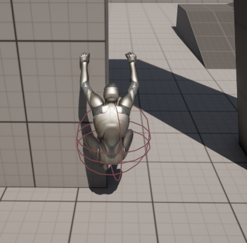

# ARPG System

目标是制作一个 ARPG 类型的游戏模板

## 正在进行

- [ ] 攀爬系统
  - [x] 攀爬系统基础框架
    - [x] 四向攀爬动作，GroundIdle 与攀爬切换
    - [x] 支持边缘检测，攀爬至边缘登顶（Climb to Top），边缘进入攀爬（Down to Climp）
    - [x] 支持 ControlRig 调整动画的 RootMotion，以及手脚的 IK 检测
- [ ] 背包系统 & 锻造系统
- [ ] 任务系统 & 成就系统、
- [ ] UI 管理系统 & 红点系统

## 目前已实现

## 计划中

- [ ] 运动系统
- [ ] AI 系统
- [ ] GAS 系统

## 遗留问题

### 攀爬系统

- 攀爬过程中遇到角度变化较大的位置

- 情况 1：
- 情况 2：
  - 猜想：遇到墙面转向时，检测转向位置，让角色停在不会出现上图的情况的位置。如果玩家继续控制角色向转向位置移动，则直接播放蒙太奇，将角色从当前墙壁转到侧面的墙壁。
  - 思路：[动作参考](https://www.mixamo.com/#/?page=1&query=free+hang)，在动画过程中设置转向，并将角色重新吸附到侧边墙壁。

